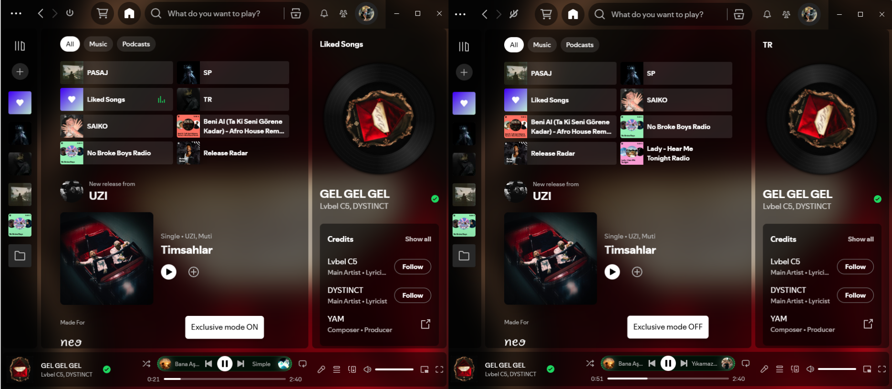

# Exclusive Mode Toggle



A Spicetify extension that adds a top bar button to toggle Spotify's Exclusive Mode without opening the Settings page.

## Features

- Toggle Exclusive Mode directly from the top bar.
- No navigation to Settings required.
- Dynamic theme-aware colors.
- ON state: clean power icon.
- OFF state: power icon with diagonal slash.
- Syncs state periodically if changed from Spotify settings.

## Requirements

- Spotify Desktop with Exclusive Mode support.
- Spicetify installed.
- Spicetify Marketplace or manual extension installation.

## Installation

### Marketplace

Search for **Exclusive Mode Toggle** in the Spicetify Marketplace and click Install.

### Manual

Copy `exclusive-mode-toggle.js` to your Spicetify Extensions folder.

Windows:

```text
%appdata%\spicetify\Extensions\
